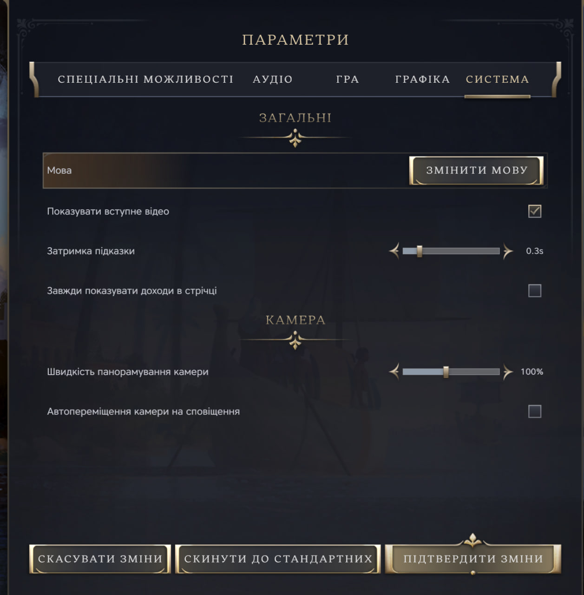

# Локалізація Civilization VII



Цей репозиторій містить український переклад для гри Civilization VII, а також CLI-застосунок для встановлення або
видалення локалізації. Будь-яка допомога з перекладом вітається.

Автори перекладу:

- Twilight (Jaden_Corr)

## Статус перекладу

### Повноцінний переклад:

0 % - На жаль, у початковій стадії організації роботи. Наразі за мету взято встигнути перекласти гру за допомогою ШІ
до релізу 11 лютого

### Переклад ШІ:

5.92 % - 5.92 % тексту гри трансформовано українською мовою за допомогою штучного інтелекту.

По модулях:
age-antiquity: 45/6033 (0.75%)
age-exploration: 58/5679 (1.02%)
age-modern: 43/5012 (0.86%)
base-standard: 103/10265 (1.00%)
core: 1438/1497 (96.06%)

Фактично на разі перекладено виключно основні елементи меню і налаштувань.

## Як встановити локалізацію?

- [ ] Додати графічний інтерфейс для застосунку інсталяції у майбутньому.

Після встановлення локалізації необхідно обрати англійську мову в налаштуваннях гри.

Наразі існує три способи встановлення локалізації. Виберіть той, що вам зручніше:

### Встановлення через Python CLI

1. На вашому комп'ютері має бути встановлений Python 3.12 або новіший.
2. Завантажте файли з цього репозиторію на свій комп'ютер.
3. Відкрийте командний рядок у теці з цими файлами.
4. Виконайте команду
   ```bash
   python -m civ_vii-cli встановити_переклад
    ```

для встановлення локалізації. Шлях до гри може бути знайдено автоматично, або ви можете передати його як аргумент
команди:

```bash
python -m civ_vii-cli встановити_переклад --шлях "C:\Шлях\До\Гри\Sid Meier's Civilization VII"
```

Додавши прапорець --ші в кінці команди, ви можете встановити варіант перекладу, виконаний штучним інтелектом.
Щоб відновити оригінальну локалізацію, виконайте команду

```bash
python -m civ_vii-cli відновити_оригінал
```

з аналогічними аргументами.

### Встановлення через .exe

Інструкція повністю збігається з наведеною вище, але вам не потрібно мати встановлений Python на комп'ютері.

### Встановлення вручну

Завантажте файли з цього репозиторію на свій комп'ютер.
Скопіюйте відповідні файли з теки resources/ua_ua до папки з грою, замінивши оригінальні файли у відповідних місцях.
Переклад, виконаний штучним інтелектом, розташований у теці resources/ua_ai.

## Як допомогти?

Ви можете допомогти як безпосередньо з перекладом, редагуючи файли локалізації, так і надсилаючи повідомлення про
помилки, які можна створювати (тут)[https://github.com/JadenCorr42/CilizationVII-ua/issues].

### Важливі правила для внесення змін

- Я розумію, що це може бути нетиповим для перекладачів, але, будь ласка, використовуйте пул-реквести на GitHub. Якщо
  вам потрібні пояснення, як із ними працювати чи як підключити репозиторій на свій комп'ютер, звертайтеся до мене за
  електронною поштою, вказаною в профілі.
- Будь ласка, не використовуйте російську мову у перекладі на будь-якому етапі. Попри всі можливі труднощі, я хочу, щоб
  переклад максимально відповідав оригінальній англійській версії.
- Версія перекладу, виконана штучним інтелектом, додана виключно для того, щоб дати можливість українцям зі слабким
  знанням англійської мови грати з першого дня релізу. Прохання: не використовуйте її як основу для повноцінного
  перекладу.